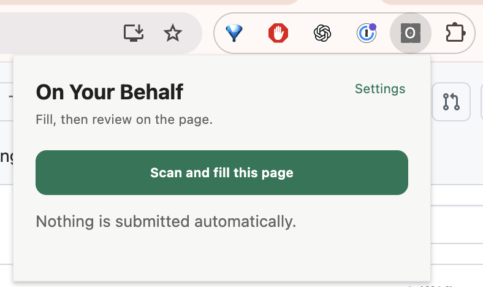
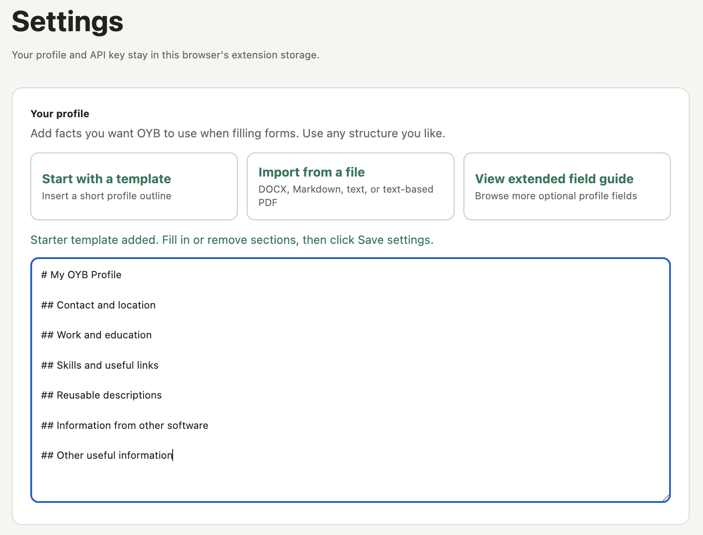
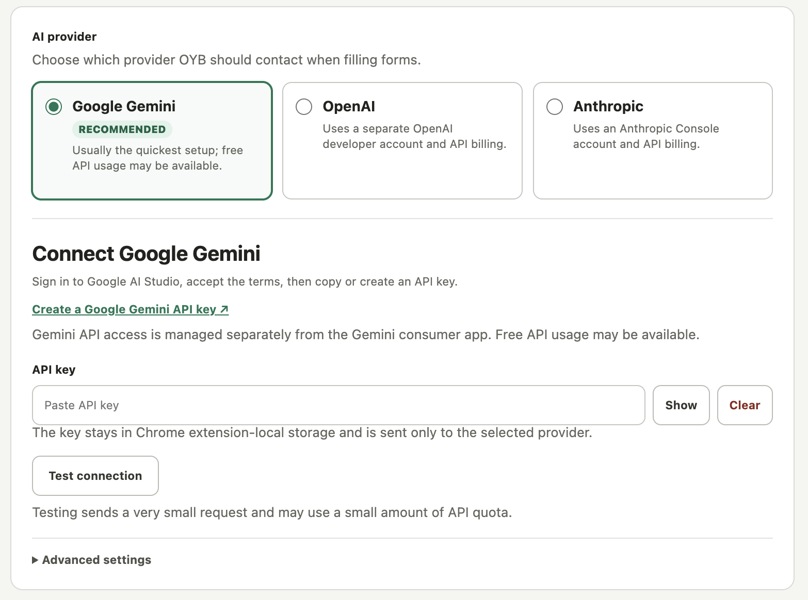

# On Your Behalf

An open-source, local-first Chrome extension that fills web forms from a personal text profile or temporary form-specific context using your choice of AI provider.

**On Your Behalf (OYB)** fills forms from a profile you control, while leaving every answer and the final submission in your hands.

Open a form, click the extension, choose which information to include, and select **Scan and fill this page**. The extension finds non-sensitive fields, asks the selected AI provider for grounded suggestions, and places those suggestions directly into the page. Filled fields receive a green outline so you can review and edit every answer before submitting the form yourself.

**Table of contents**

- [Features](#features)
- [Screenshots](#screenshots)
- [Install locally in Chrome](#install-locally-in-chrome)
- [Privacy and security model](#privacy-and-security-model)
- [Test](#test)
- [Product roadmap](#product-roadmap)
- [Project structure](#project-structure)
- [Contributing and security](#contributing-and-security)
- [Current limitations](#current-limitations)
- [License](#license)

## Features

- Uses one flexible, plain-text profile instead of a rigid collection of profile fields.
- Accepts temporary context for a particular form or event and can fill without sending the saved profile.
- Optionally remembers temporary context until Chrome closes, with an immediate clear action.
- Imports editable profile text locally from DOCX, Markdown, plain text, and text-based PDF documents.
- Keeps optional supporting files separate from the editable profile, with per-file enablement and a per-fill inclusion control.
- Supports Google Gemini, OpenAI, and Anthropic with your own API key.
- Provides provider-specific key setup links, connection testing, and plain-language setup errors.
- Fills text inputs, textareas, checkboxes, radio groups, native selects, and common ARIA comboboxes.
- Rescans and continues through bounded rounds when choices reveal, remove, or change dependent fields.
- Reports profile facts that are missing and questions that require the user's judgment.
- Offers a per-fill answering posture, including a strongest-truthful-case mode that emphasizes relevant and transferable experience without authorizing unsupported claims.
- Handles React-style controlled text fields using native value setters and browser events.
- Skips password, payment-card, and authentication-code fields individually.
- Never submits a form or clicks a next/continue button.
- Stores the profile, provider choice, model, and provider-specific API keys in Chrome extension-local storage.
- Has no backend, account, analytics, or telemetry.
- Uses `activeTab`: it can inspect a page only after you click the extension's fill action.
- Includes a dedicated high-contrast toolbar icon designed to remain recognizable at Chrome's smallest extension-icon size.

## Screenshots

The popup starts a fill and reminds the user that OYB never submits the form.



Profile settings support a short starter outline, document import, freeform editing, and an optional extended field guide.



Provider settings guide users through getting, testing, and safely storing their own API key.



## Install locally in Chrome

1. Open `chrome://extensions`.
2. Enable **Developer mode**.
3. Click **Load unpacked**.
4. Select this project directory—the directory containing `manifest.json`.
5. Pin **On Your Behalf** from Chrome's Extensions menu.
6. Open the extension and select **Settings**.
7. Add a text profile, choose a provider, follow its API-key setup link, and test the connection.
8. Open a web form, click the extension, optionally add context for that form, choose whether to include the saved profile, and select **Scan and fill this page**.
9. Review every green-outlined answer before submitting the form yourself.

In Settings, you can import any profile-relevant document in a supported format instead of entering the profile by hand. You can also add up to 10 supporting files that remain separate from the editable profile; enable or disable each file in Settings and choose whether to include the enabled set for each fill. [`PROFILE-TEMPLATE.md`](PROFILE-TEMPLATE.md) provides a short outline that can be copied into Google Docs, completed, downloaded as a DOCX file, and imported into OYB. The [`PROFILE-FIELD-GUIDE.md`](PROFILE-FIELD-GUIDE.md) extended guide offers more ideas without making them part of the default template. DOCX, Markdown, and plain text preserve structure most reliably. Text-based PDFs are supported, but multi-column layouts may extract out of order; scanned PDFs are not supported. Imported profile text and supporting files may be sent to your selected AI provider and are not saved until you choose **Save settings**.

After filling, the popup lists factual answers missing from your profile and questions that require a decision. Use **Open profile settings** to add durable facts; judgment calls remain for the current form.

Use **Context for this form** for facts about a particular event, application, claim, activity, or transaction that should not become part of the durable profile. **Remember until Chrome closes** stores that draft in browser-session extension storage so it can survive popup reopenings; **Clear context** removes it immediately. For forms that record one item at a time, provide one event or activity per fill action.

After changing source files, click the extension's reload button on `chrome://extensions` before testing again.

## Privacy and security model

The extension has no server of its own. Your profile and provider-specific API keys are stored using `chrome.storage.local`, and a form request goes directly from the extension to the provider you selected. Chrome extension-local storage is isolated from normal webpages, but it is not a dedicated password manager or hardware-backed secret store.

The extension sends the selected provider:

- Your text profile when **Include saved profile** is enabled.
- The enabled supporting files when **Include supporting files** is enabled.
- Temporary form-specific context when you provide it.
- The page origin/path, title, and primary heading. URL query parameters and fragments are removed.
- Labels and metadata for the detected non-sensitive form fields.

It does not intentionally send current field values. Page text is treated as untrusted input in the AI prompt, and returned suggestions are restricted to field identifiers created during the current scan. Conditional forms may require several provider requests, each limited to newly discovered or meaningfully changed empty fields. These controls reduce prompt-injection risk but cannot eliminate it. Review suggestions before submitting sensitive or consequential forms.

The selected model may use its general knowledge to interpret terminology and relationships between technologies, but OYB instructs it to treat only your enabled profile and form context as evidence of your personal experience. Answering posture changes how supported experience is presented; it never authorizes invented product use, pricing or sales responsibility, or other unsupported claims. Consent, acceptance, attestations, and comparable decisions remain for you.

Saved profiles, supporting-file text, and API keys use durable `chrome.storage.local`. Optional temporary-context retention uses `chrome.storage.session`, is not merged into the profile, and is intended to clear with the browser session.

Choosing **Test connection** sends the selected provider a small request asking it to reply with `OK`. The test does not include your profile or information from a web form, but it may use a small amount of API quota.

## Test

Requires Node.js 18 or newer. The runtime PDF library is vendored so the unpacked extension does not need a build step; `npm install` is needed only when updating that library.

```bash
npm test
npm run check
```

See [`DEVELOPMENT.md`](DEVELOPMENT.md) for the manual Chrome test loop.

## Product roadmap

Completed onboarding direction and the remaining profile, portability, and first-run ideas are tracked in the [`product roadmap`](docs/roadmap/product-ideas.md). Concrete feature designs live separately under `docs/design/`.

## Project structure

- `manifest.json` — Manifest V3 extension configuration and version.
- `src/background.js` — AI request orchestration.
- `src/content.js` — page scanning and filling.
- `src/form-core.js`, `src/form-state.js`, `src/prompt.js`, `src/providers.js`, `src/document-import.js`, and `src/supporting-documents.js` — standalone form, scan-state, prompt, parsing, provider, document-import, and supporting-file logic.
- `src/vendor/` — browser-ready PDF.js distribution with its license.
- `src/popup.*` — compact scan-and-fill action.
- `src/options.*` — profile and provider settings.
- `docs/images/` — screenshots used in this README.
- `icons/` — extension icon sizes and the high-resolution generated source artwork.
- `docs/design/` — implementation-ready feature designs.
- `docs/roadmap/` — longer-term product direction and ideas.
- `test/*.test.js` — unit tests for standalone logic.
- `test/manual-form.html` — a manual compatibility fixture.
- `PROFILE-TEMPLATE.md` — short Google Docs-friendly starter profile.
- `PROFILE-FIELD-GUIDE.md` — optional extended list of profile fields and migration guidance.

## Contributing and security

Contributions are welcome. Read [`CONTRIBUTING.md`](CONTRIBUTING.md) for the project invariants, development workflow, testing expectations, and pull-request guidance.

Please do not disclose suspected vulnerabilities in a public issue. Follow [`SECURITY.md`](SECURITY.md) to start a private report or request a private contact channel without including sensitive details.

## Current limitations

- Custom selects vary widely; OYB supports common visible ARIA `combobox`/`option` patterns and tested PrimeFaces-style widgets, not every component library.
- Cross-origin iframes and closed shadow roots are not scanned.
- Conditional fields on the current page are rescanned automatically, but navigation to a separate page still requires another fill action.
- File uploads and rich-text editors are skipped.
- Provider keys are stored locally but are not protected like credentials in a password manager.
- There is no Ollama support yet.
- Scanned PDFs require OCR and cannot be imported; complex PDF columns may extract out of order.

## License

On Your Behalf is available under the MIT License. See `LICENSE`.
